# Tuwaiq Rating App
The **Tuwaiq Rating App** is a Flutter-based application designed to streamline project rating and management. Users can easily create and manage accounts with secure login features, allowing them to explore and rate various projects while providing valuable feedback. The app includes dark and light mode options for a personalized experience. Project leaders can create, update, and delete their projects, as well as view ratings and comments, while supervisors grant them necessary permissions to manage projects effectively. Administrators have full access to manage users and projects, including role assignments. 


## Table of Contents

- [App Overview](#app-overview)
- [Features](#features)
- [API](#API)
- [Design Philosophy](#design-philosophy)
- [Getting Started](#getting-started)
- [Future Enhancements](#future-enhancements)
- [OutPut](#OutPut)
- [Created By](#created-by)

## App Overview

### Features

1. **User Authentication**
   - integrates a more secure system utilizing OTP (One-Time Password) authentication for both sign-in and sign-up processes. 
   - Redirects users to the Home page if already logged in; otherwise, prompts login.

2. **Home**
   - Displays the **top five rated** projects, allowing users to quickly access the highest-rated submissions. Below this section, users can find a comprehensive list of all Bootcamps, organized by category for intuitive browsing.
   -Each Bootcamp category features a detailed list of projects relevant to that specific focus area.

3. **Project View and mange**
   - provides users with a comprehensive view of project details. Users can access essential information, including the project title, description, type, screenshots, presentation materials, team members, submission date, bootcamp name, and presentation date. Additionally, users can rate the project conveniently using a QR code, enhancing the feedback process.
   
    - For project leaders, the screen allows for seamless management of their projects, enabling them to update or delete their submissions as needed. Supervisors and administrators also possess the capability to update and delete any project, ensuring that all content remains relevant and accurate. This multifaceted access promotes effective project oversight and management across the platform.

4. **Rating**
   - Allows all users to evaluate projects on a scale of 1 to 10, assessing key aspects such as **Project Idea**, **Design**, **Tools**, and **Presentation**.

   - In addition, users can also add **comments** to express their thoughts more comprehensively.

5. **Profile**
   - showcases essential user information, including full name, user ID, email, resume, a list of projects, and links to social media profiles. If available, users can easily navigate to their social media accounts directly from this section.

   - Users also have the option to copy their user ID for sharing purposes. Additionally, the app allows users to edit their profile data, including updating their full name, resume, and social media links.
   - For team leaders, there is a dedicated feature that enables them to add projects, facilitating seamless project management directly from their profile.

6. **Settings**
   - Offers users the ability to switch between dark and light mode, enhancing their viewing experience according to personal preference. This section also provides essential information about the Tuwaiq Rating App, including  Help & Support, Terms & Conditions and Privacy Policy.

### API

### Networking API Integration

The **Tuwaiq Rating App** utilizes a **networking API** to facilitate seamless communication between the client and server. This integration ensures that all user interactions, project data, and ratings are efficiently processed and updated in real time. 

Through the API, users can securely authenticate their accounts using OTP verification, retrieve project details, and submit ratings. The app fetches the latest data on top-rated projects and bootcamp categories, ensuring users have access to up-to-date information. 

Additionally, the API supports user profile management, enabling users to update their information and manage their projects effortlessly. For project leaders, the API allows for project creation, updates, and deletions, ensuring smooth project management. 


**Tuwaiq Rating App** is a fully functional Rating management app, focusing on both UI design and backend functionality. The app supports full user interaction, including project creation, management, rating, and retrieval, with data stored.

## Getting Started

### Prerequisites

- Flutter SDK
- A code editor (such as VS Code or Android Studio)

### Installation

1. Clone the repository:

   ```bash
   git clone https://github.com/amer266030/Project-7.git
   ```

2. Navigate to the project directory:

    ```bash
   cd Project-7
   ```

3. Get the dependencies:

    ```bash
   flutter pub get
   ```

4. Run the app:
    ```bash
   flutter run
   ```

### Future Enhancements

* ### Future Enhancements

* Search Functionality: Implementing a search feature will enhancement will improve usability and streamline navigation within the app.

* Arabic Language Support:  This enhancement will make the Tuwaiq Rating App more inclusive and user-friendly for our community.

## OutPut
* signup, signin, otp screens:

<p align="center">

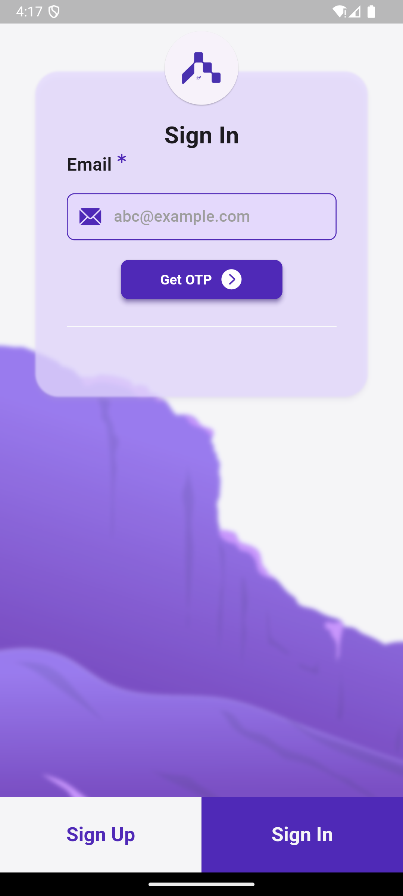
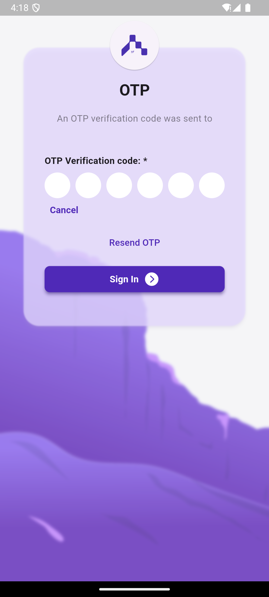


* home & project details screens

<p align="center">
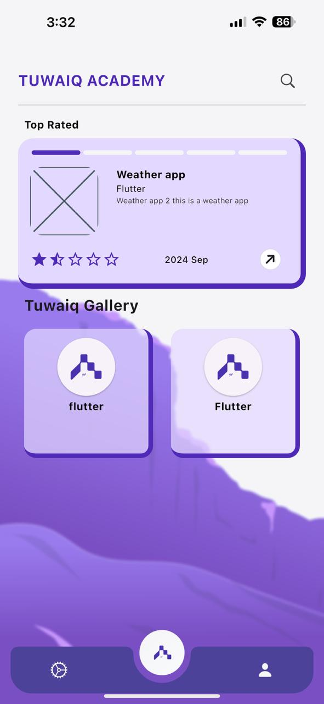
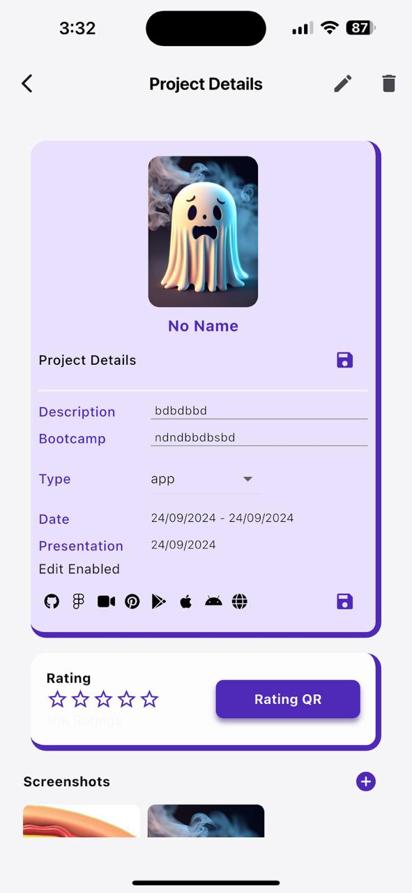

* Profile & my project screens:

<p align="center">
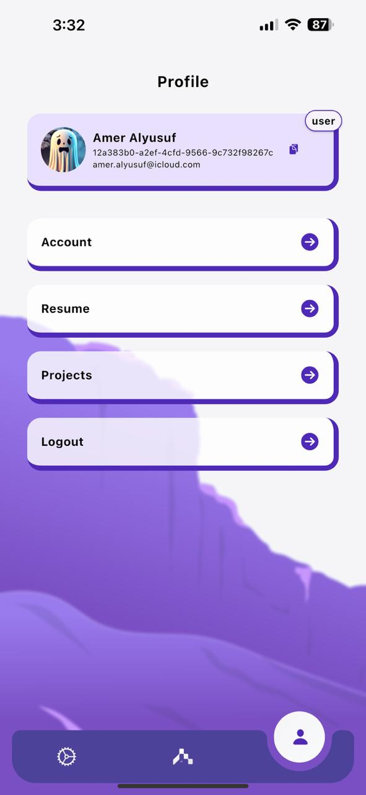
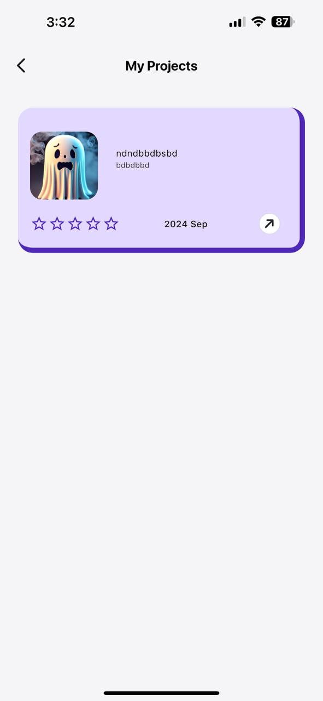

* Edit Profile screen and update url alert

<p align="center">

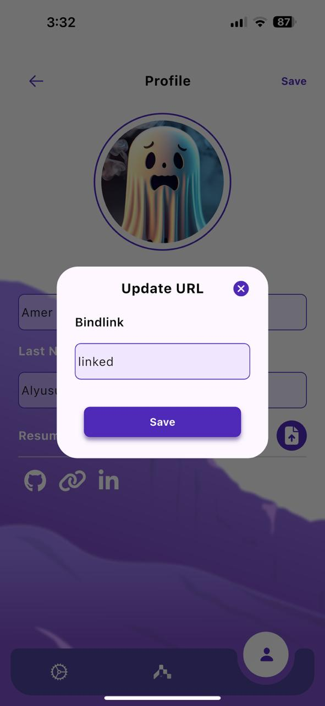

* setting screen

<p align="center">
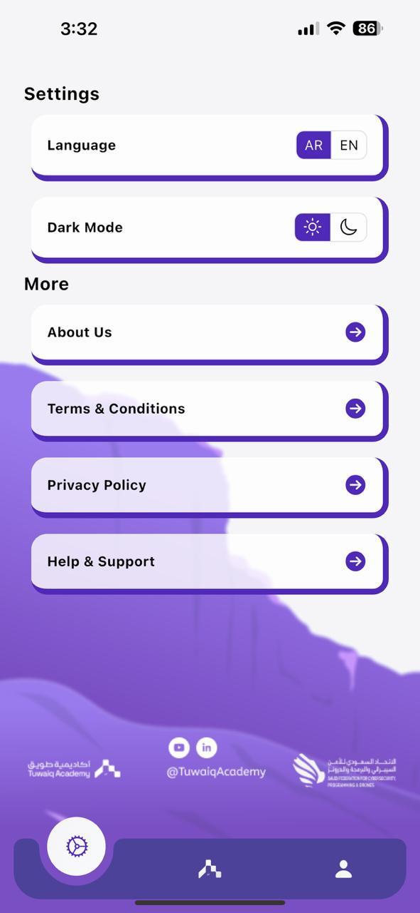

* Dark screens

<p align="center">
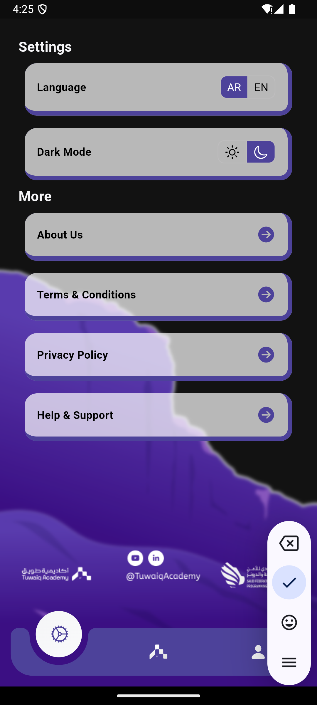
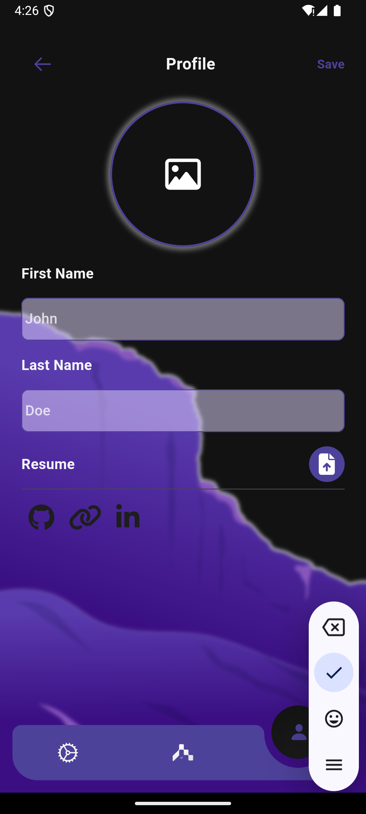
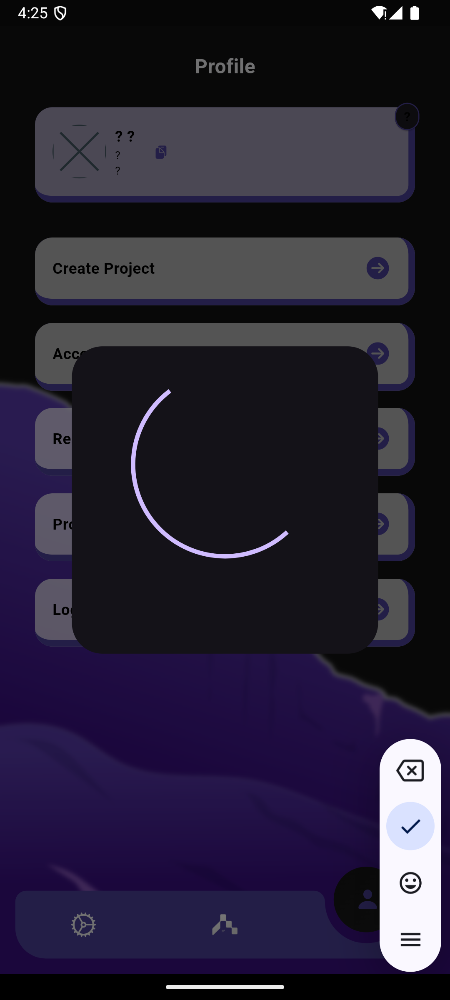

## Created By
- **Amer Alyusuf**
- **Yara Albouq**
- **Abdullah Mukhlef Al-Shammari**

